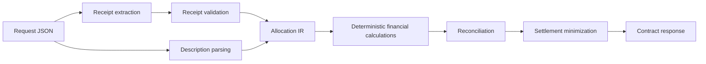

# Fair Split

Fair Split is a dependency-light submission for the GenAI receipt splitting assignment. It accepts the required JSON contract, extracts a structured receipt, parses the plain-English allocation description, validates all model output, computes rupee totals deterministically, reconciles the bill, and returns the exact response shape.

## Run

```powershell
$env:OPENAI_API_KEY="..."
python -m fair_split.app
```

Open `http://127.0.0.1:8000`.

The API endpoint is:

```http
POST /split
Content-Type: application/json

{
  "receipt_base64": "<base64 image bytes, no data URI prefix>",
  "description": "<plain-English allocation and payer>"
}
```

For local tests, `receipt_base64` may also contain base64-encoded JSON in the receipt schema. This is intentionally separate from the production image path and makes calculation behavior deterministic and repeatable.

## Architecture



Model output is treated as untrusted. The LLM is only used to convert an image into structured receipt JSON. Item totals, tax, service charge, discounts, rounding, reconciliation, and settlement are all handled in Python.

## Validation Strategy

- Reject malformed base64 and oversized files.
- Require structured receipt fields and line-item names.
- Check line-item sum against printed subtotal.
- Check subtotal, tax, service, discount, tip, fees, and grand total arithmetic.
- Flag missing payer instead of assuming one.
- Flag items that are not allocated.
- Preserve assumptions for phrases such as "everything else" and "rest of us".
- Reconcile `sum(per_person.total)` against `grand_total` in every response.

## Observability

The app logs access, extraction failures, receipt validation flags, and reconciliation failures. Logs avoid receipt text and personal details beyond counts/reasons.

## Tradeoffs

- The local environment lacks Tesseract/FastAPI/frontend tooling, so this submission uses a stdlib HTTP server and static frontend.
- Vision extraction is pluggable through `OPENAI_API_KEY`. Without a configured OCR/LLM provider, image requests are flagged rather than guessed.
- The rule-based description parser handles the required samples and common phrases, but low-confidence language is surfaced through flags instead of being silently forced.

## Test

```powershell
python -m unittest discover -s tests
```

